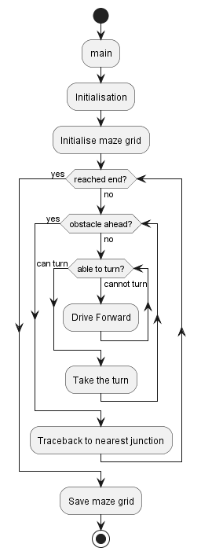
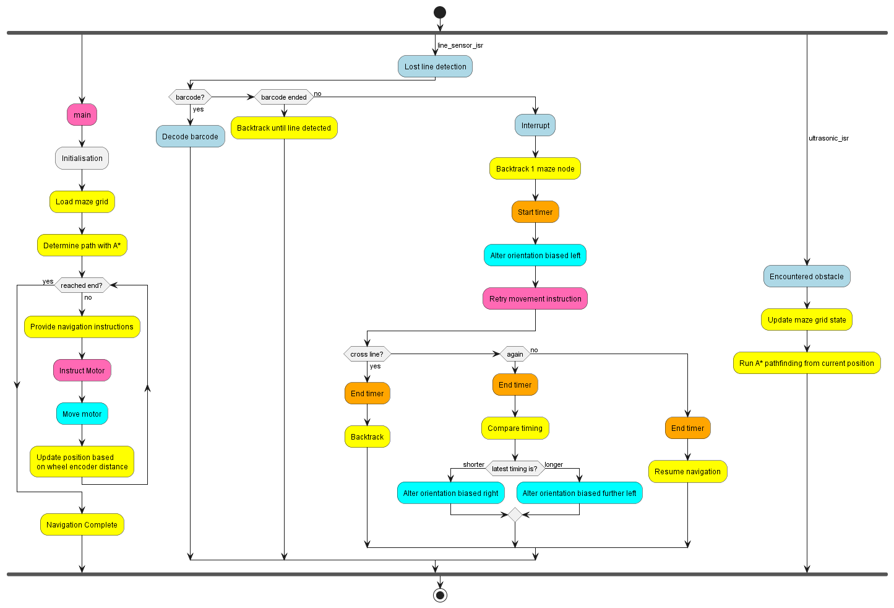

# INF2004 Autonomous Car Project

# Requirements
- [Pico SDK v1.5.1](https://github.com/raspberrypi/pico-sdk/)
- Pico ARM Toolchain
    - CMake v3.13+
    - ARM GCC EABI v10.3.1
- Pico W board
- [FreeRTOS Kernel v10.6.1](https://github.com/FreeRTOS/FreeRTOS-Kernel/releases/tag/V10.6.1)

## Environment Variables

| Variable | Description |
| -- | -- |
| `PICO_SDK_PATH` | Path to the Pico SDK directory |
| `FREERTOS_KERNEL_PATH` | Path to the FreeRTOS Kernel directory |
| `WIFI_SSID` | Wi-Fi network SSID |
| `WIFI_PASSWORD` | Wi-Fi network password |
| `TEST_BUILD` | Define to enable `ctest` testing |


# Compilation

## CMake Configuration
```bash
cmake -S <current directory> -B <build directory>
```

## CMake Build
```bash
cmake --build <build directory> --config <Debug/Release> --target car_project -j 18 --
```

# Testing
Unit testing of code that is independent of the Pico SDK is done with `ctest` by defining the environment variable `TEST_BUILD`. Some configuration changes to your environment will be required such as changing the compiler toolkit so that the tests may run on your machine.

# Diagrams
## Call Graph


## Data Flow


## Flowcharts
### Mapping flowchart

### Navigation flowchart


# Contributing

Pull requests are welcome. The enforced coding standard is the [Embedded C Coding Standard by the Barr Group](https://barrgroup.com/embedded-systems/books/embedded-c-coding-standard).

# Licence
[BSD-3-Clause](LICENSE.txt)